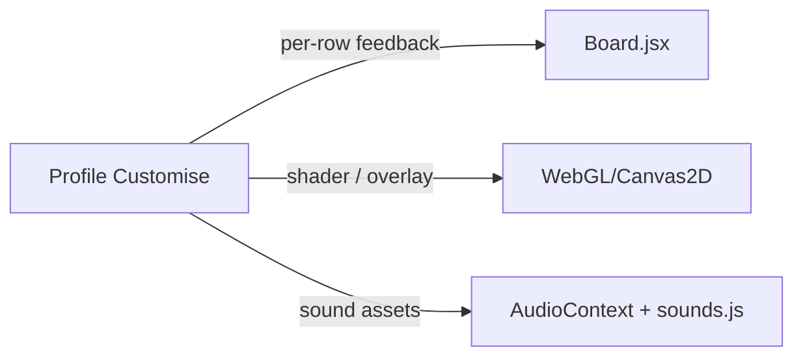

# Cosmetics roadmap

This file tracks the deeper visual behaviour described in the cosmetics spec but
**deferred** from the initial Tier 1 catalog overhaul. The Tier 1 work landed
14 board themes plus the multi-slot system (board / font / cursor / win
animation / sound + seasonal hooks); the items below are good follow-ups when
we have time for richer interaction.

## Architecture

## Deferred per-theme behaviour

| Theme | Deferred behaviour |
|-------|--------------------|
| Aurora | Row ripple — cyan → magenta wash across a completed row |
| Liquid Mercury | Tiles "melt" into each other on completion, then re-solidify |
| Stained Glass | Beam of light sweeps across a completed row |
| Origami | Winning row folds into a crane that flies off-screen |
| Retro Arcade (CRT) | Screen-curvature shader, combo counter, "STAGE CLEAR" overlay |
| Ninja Village | Shuriken whoosh on flip, smoke-bomb vanish on incorrect guesses |
| Cyber / Synthwave | Glitch shake on wrong, VHS rewind on undo |
| Trading Card | Holographic foil that responds to cursor position in real time |
| Botanical Garden | Vines grow around the border the more rows you complete |
| Ceramic | Row "fires" with a warm kiln glow when locked |
| Library / Inkwell | Quill scratches a tick at the row end |
| Championship Gold | Row engraves itself like a plaque |
| Volcanic | Cooling lava — orange when placed, crusting to black when locked |
| Constellation | Completed letters draw connecting lines into a growing constellation |

## Other follow-ups

- **Custom font files** — bundle web fonts (Press Start 2P, Cormorant) instead of
  relying on local fallbacks.
- **Richer sound packs** — separate asset folders per pack instead of pitch / volume
  modulation on the standard sounds.
- **Cursor trail performance** — switch DOM-based dots to a canvas pool when
  needed.
- **Seasonal automation** — auto-grant `seasonal:cherry_blossom` on first daily
  during the active window, and remove the equip when the window closes.
- **Phase 2 unlock catalog** — once per-row animations land, gate richer themes
  behind harder achievements.

## How to add another slot

1. Add a catalog file under [`server/progression/cosmetic-*.js`](server/progression/).
2. Register it in [`server/progression/cosmetics-registry.js`](server/progression/cosmetics-registry.js)
   (`COSMETIC_SLOTS`).
3. Mirror it under [`client/src/config/cosmetic-*.js`](client/src/config/) and
   extend [`getEquippedBundle`](client/src/config/cosmetics.js).
4. Update Profile Customise + Dev Lab UI to expose the new slot.
5. Add a Jest case in [`server/tests/progression.test.js`](server/tests/progression.test.js)
   covering equip validation.
